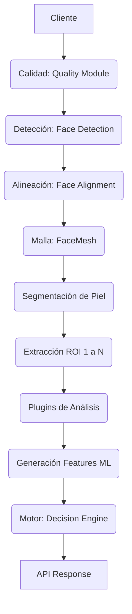
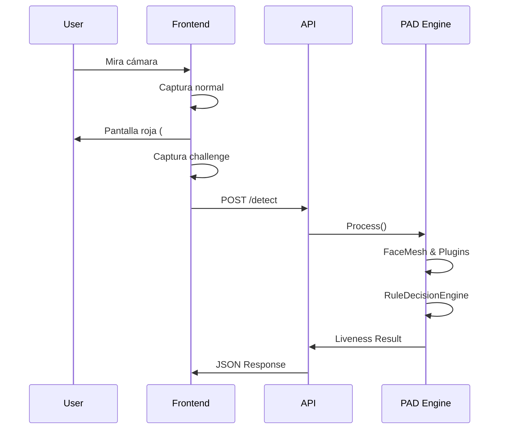

# Presentation Attack Detection (PAD) API

## Migración desde la versión anterior

**Compatibilidad Retroactiva (Backwards Compatibility):**
La API ha sido diseñada para ser **100% compatible con la versión anterior**. Ningún campo del contrato original fue modificado ni eliminado. Los clientes existentes que consumen el endpoint `/api/v1/detect` con los parámetros antiguos seguirán recibiendo exactamente la misma estructura base que conocen.

**Para aprovechar las nuevas capacidades (Nivel Empresarial):**
1. Agregue el campo `challenge_color` al FormData de su petición con el formato hexadecimal (ej. `#00FF00`).
2. Comience a evaluar el nuevo bloque `liveness` en el JSON de respuesta. Ya no se limite al campo booleano `is_manipulated`, el nuevo bloque `liveness.decision` y `liveness.classification` proveen un contexto forense de ataques específicos.

---

## 1. Introducción

### ¿Qué es Presentation Attack Detection (PAD)?
El PAD (Detección de Ataques de Presentación) es el conjunto de tecnologías biométricas diseñadas para detectar si un rasgo biométrico (en este caso, un rostro) está siendo falsificado mediante métodos físicos o digitales frente al sensor (cámara).

### Diferencia entre DeepFake Detection y Liveness Detection
- **DeepFake Detection:** Busca anomalías en los píxeles, artefactos de IA, y sobre-procesamiento para determinar si una imagen fue alterada matemáticamente.
- **Liveness Detection (PAD):** Verifica que el rostro pertenece a un humano **vivo** y **presente** físicamente en el instante de la captura.
- **Nuestro Motor Híbrido:** Combina un modelo DeepFake (Xception) con Liveness Activo (Challenge de Reflexión de Luz) para crear una barrera infranqueable frente a ataques.

---

## 2. Arquitectura del Sistema

El sistema procesa la entrada a través de un Pipeline de procesamiento secuencial estricto y asíncrono.



## 3. ¿Qué cambió respecto a la versión anterior?

| Característica | Antes | Ahora (Versión 2.0.0 PAD) |
|---|---|---|
| **Modelo Principal** | DeepFakeBench Xception | Híbrido (Xception + Liveness Físico) |
| **Color Space** | HSV (Básico) | LAB + CIE DE2000 (Perceptual) |
| **Detección ROIs** | Haar Cascades (Rectangular) | MediaPipe FaceMesh (Topológico) |
| **Cobertura de Ataques**| Deepfakes | Deepfake, Replay, Screen, Virtual Cams |
| **Trazabilidad** | Nula | Completa (Confidence per feature) |

---

## 4. Endpoint

**Ruta:** `POST /api/v1/detect`

## 5. Parámetros

**Content-Type:** `multipart/form-data`

| Campo | Tipo | Requerido | Descripción |
|---|---|---|---|
| `file` o `video` | File | Sí | Archivo principal a evaluar (MP4, JPG, PNG). |
| `challenge_image` | File | Opcional | Fotografía capturada bajo la iluminación del challenge. |
| `normal_image` | File | Opcional | Fotografía base de iluminación neutra. |
| `challenge_id` | String | Opcional | UUID o Tracking ID para la sesión. |
| `challenge_color` | String | Opcional | Color emitido en pantalla, formato `#RRGGBB`. Si no se envía, la evaluación física será limitada. |

---

## 6. Flujo de Consumo (Liveness Activo)

1. **Captura Base:** El SDK/Frontend captura la `normal_image` en condiciones de luz normales.
2. **Iluminación:** Se despliega un rectángulo o flash con un color aleatorio (ej. `#FF0000`).
3. **Captura Challenge:** A los ~800ms, se captura la `challenge_image`.
4. **Envío POST:** Se dispara la petición a la API adjuntando imágenes, video y el `challenge_color`.
5. **Decisión:** La API responde en milisegundos con el diagnóstico forense.

---

## Ejemplos de Implementación (7 - 13)

### 7. cURL
```bash
curl -X POST https://api.midominio.com/api/v1/detect \
  -F "video=@capture.mp4" \
  -F "normal_image=@normal.jpg" \
  -F "challenge_image=@flash.jpg" \
  -F "challenge_id=xyz-123" \
  -F "challenge_color=#00FF00"
```

### 8. Postman
1. Seleccione método `POST`.
2. Vaya a `Body` -> `form-data`.
3. Configure `video`, `normal_image`, y `challenge_image` en tipo **File**.
4. Configure `challenge_color` en tipo **Text** (Ej: `#00FF00`).

### 9. Laravel
```php
$response = Http::attach(
    'normal_image', file_get_contents($normal), 'normal.jpg'
)->attach(
    'challenge_image', file_get_contents($challenge), 'challenge.jpg'
)->post('/api/v1/detect', [
    'challenge_color' => '#FF0000'
]);
```

### 10. JavaScript (Fetch / FormData)
```javascript
const formData = new FormData();
formData.append('normal_image', fileNormal);
formData.append('challenge_image', fileChallenge);
formData.append('challenge_color', '#0000FF');

fetch('/api/v1/detect', { method: 'POST', body: formData });
```

### 11. React
```jsx
// Exactamente igual a JS vainilla
const handleSubmit = async () => {
    const formData = new FormData();
    formData.append("challenge_color", "#FFFF00");
    // Append files...
    await axios.post("/api/v1/detect", formData);
};
```

### 12. Flutter
```dart
var request = http.MultipartRequest('POST', Uri.parse('/api/v1/detect'));
request.fields['challenge_color'] = '#FF0000';
request.files.add(await http.MultipartFile.fromPath('normal_image', normalPath));
var response = await request.send();
```

### 13. React Native
```javascript
const formData = new FormData();
formData.append('challenge_color', '#00FF00');
formData.append('normal_image', {
  uri: photo.uri,
  type: 'image/jpeg',
  name: 'normal.jpg',
});
```

---

## Respuesta y Estructura (14 - 24)

### Estructura General
```json
{
  "filename": "video.mp4",
  "is_manipulated": false,
  "deepfake_probability": 0.05,
  "liveness": {
    "is_live": true,
    "confidence": 0.98,
    "confidence_interval": "0.96-0.99",
    "attack_probability": 0.02,
    "decision": "LIVE",
    "risk": "LOW",
    "classification": "NONE",
    "analysis": ["✓ Textura", "✓ Color"]
  },
  "advanced_metrics": {},
  "features": {}
}
```

### 18. Bloque Liveness
- **is_live**: (bool) Decisión booleana final.
- **confidence**: (float) Probabilidad de vida.
- **confidence_interval**: Margen estadístico de error calculado por el motor.
- **attack_probability**: (float) 1 - confidence.
- **decision**: `LIVE` o `SPOOF`.
- **risk**: `LOW`, `MEDIUM`, `HIGH`, `CRITICAL`.
- **classification**: Tipificación exhaustiva forense del ataque.

### 19. Tipos de Ataque (`classification`)
- `NONE`: Usuario real, vivo y presente.
- `REPLAY_ATTACK`: Reproducción general de una grabación.
- `SCREEN_ATTACK`: Iluminación plana y uniforme característica de una pantalla emisora.
- `VIRTUAL_CAMERA`: Alteración en los timestamps (latencia de inyección OBS/ManyCam).
- `DEEPFAKE` / `GENERATIVE_AI`: Alisado de texturas (PSD anormal).
- `FACE_SWAP`: Rostro pegado con discrepancias en los bordes.

### 16. Bloque Advanced Metrics & 17. Features
El bloque `features` es un vector numérico 1D, aplanado y listo para exportarse a `.csv` y entrenar redes neuronales o XGBoost (`"left_cheek_psd": 4.5`). Las métricas avanzadas incluyen el análisis pormenorizado forense.

### 23. Performance y 24. Versionado
Se inyectan `engine_version` y los tiempos en ms de procesamiento por nodo del pipeline, optimizado para trazabilidad.

---

## 28. Diagrama de Secuencia



## 30. Roadmap a Futuro

La arquitectura `Plugin` quedó preparada para:
1. **Blink & Gaze Tracker:** Validación contra avatares 3D estacionarios.
2. **Infrared & Depth Detection:** Soporte para Hardware TrueDepth (Apple) y cámaras ToF.
3. **ML Decision Engine:** El bloque `features` es la piedra fundacional para migrar a Random Forest / XGBoost en el futuro, desestimando las reglas fijas, sin modificar el contrato de la API.
